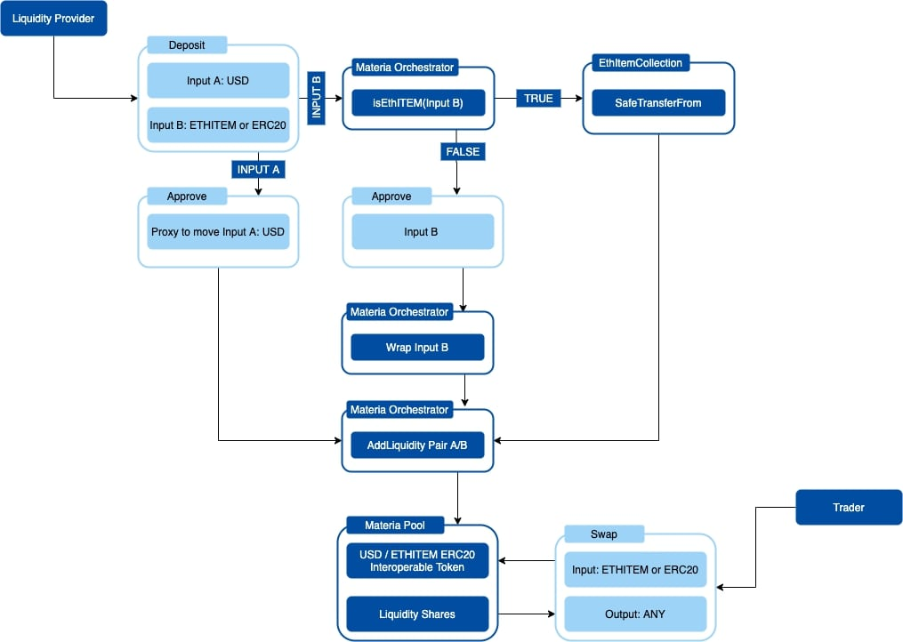

# Introduction

Each Materia liquidity pool is a trading venue for a WUSD and a ITEM ERC20 Interoperable. When a pool contract is created, its balances of each token are 0; in order for the pool to begin facilitating trades, someone must seed it with an initial deposit of each token. This first liquidity provider is the one who sets the initial price of the pool. They are incentivized to deposit an equal _value_ of both tokens into the pool. To see why, consider the case where the first liquidity provider deposits tokens at a ratio different from the current market rate. This immediately creates a profitable arbitrage opportunity, which is likely to be taken by an external party.

When other liquidity providers add to an existing pool, they must deposit pair tokens proportional to the current price. If they don’t, the liquidity they added is at risk of being arbitraged as well. If they believe the current price is not correct, they may arbitrage it to the level they desire, and add liquidity at that price.

# Pool tokens

Whenever liquidity is deposited into a pool, unique tokens known as _materia liquidity tokens (MP)_ are minted and sent to the provider's address. These tokens represent a given liquidity provider's contribution to a pool. The proportion of the pool's liquidity provided determines the number of liquidity tokens the provider receives. If the provider is minting a new pool, the number of liquidity tokens they will receive will equal sqrt(x \* y), where x and y represent the amount of each token provided.

Whenever a trade occurs, a 0.3% fee is charged to the transaction sender. This fee is distributed _pro-rata_ to all LPs in the pool upon completion of the trade. This fee could be changed via a Governance Proposal on each pair.

To retrieve the underlying liquidity, plus any fees accrued, liquidity providers must "burn" their liquidity tokens, effectively exchanging them for their portion of the liquidity pool, plus the proportional fee allocation.

As liquidity tokens are themselves tradable assets, liquidity providers may sell, transfer, or otherwise use their liquidity tokens in any way they see fit.

Learn more with advanced topics:

<InlineBoxLink title="Understanding Returns" to="docs/materia/advanced-topics/understanding-returns" />
<InlineBoxLink title="Fees" to="docs/materia/advanced-topics/fees" />

# Why pools?

Materia, like Uniswap, is unique in that it doesn’t use an order book to derive the price of an asset or to match buyers and sellers of tokens. Instead, Materia uses what are called Liquidity Pools.

Liquidity is typically represented by discrete orders placed by individuals onto a centrally operated order book. A participant looking to provide liquidity or make markets must actively manage their orders, continuously updating them in response to the activity of others in the marketplace.

While order books are foundational to finance and work great for certain usecases, they suffer from a few important limitations that are especially magnified when applied to a decentralized or blockchain-native setting. Order books require intermediary infrastructure to host the orderbook and match orders. This creates points of control and adds additional layers of complexity. They also require active participation and management from market makers who usually use sophsticated infrastructure and algorithms, limiting participation to advanced traders. Order books were invented in a world with relatively few assets being traded, so it is not surprising they aren't ideal for an ecosystem where anyone can create their own token and those tokens usually have low liquidity. In sum, with the infrastrucural trade-offs presented by a platform like Ethereum, order books are not the native architecture for implementing a liquidity protocol on a blockchain.

It is important to reiterate that a Pool is just a smart contract, operated by users calling functions on it. Swapping tokens is calling `swap` on a Pool contract instance, while providing liquidity is calling `deposit`.

Just how end-users can interact with the Materia protocol through the Interface (which in turn interacts with the underlying contracts), developers can interact directly with the smart contracts and integrate Materia functionality into their own applications without relying on intermediaries or needing permission.

# Developer resources

- To see how to pool tokens in a smart contract read [Providing Liquidity](/docs/materia/smart-contract-integration/providing-liquidity/).
